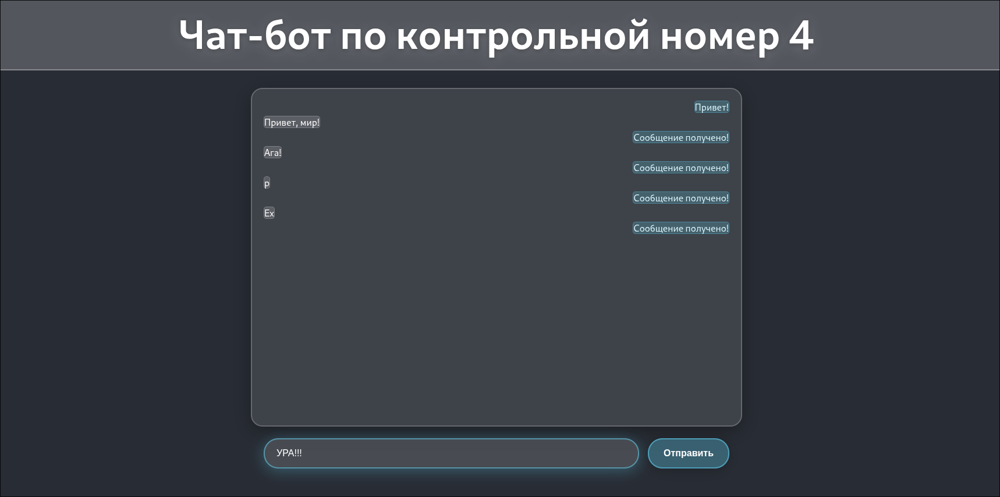
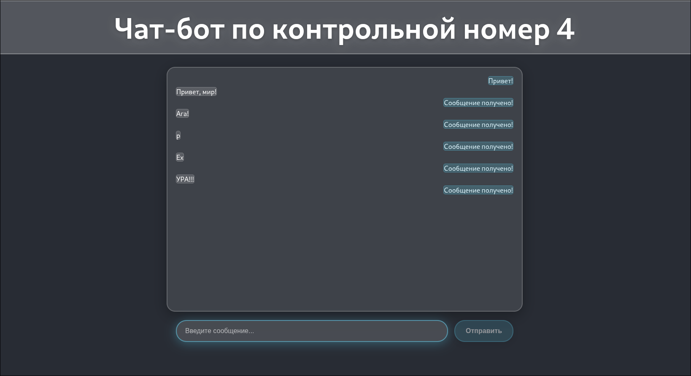

# Чат-приложение

Простое React-приложение для обмена сообщениями.

## Функциональность

- Отправка сообщений по нажатию Enter
- Два типа сообщений: от пользователя и системы
- Автоматические ответы от системы
- Адаптивный интерфейс

## Технологии

- React
- CSS3
- HTML5

## Особенности реализации

- Минималистичный дизайн в стиле мессенджеров
- Сообщения занимают только необходимую ширину
- Разделение на компоненты: сообщения, поле ввода
- Состояние управляется через React Hooks

